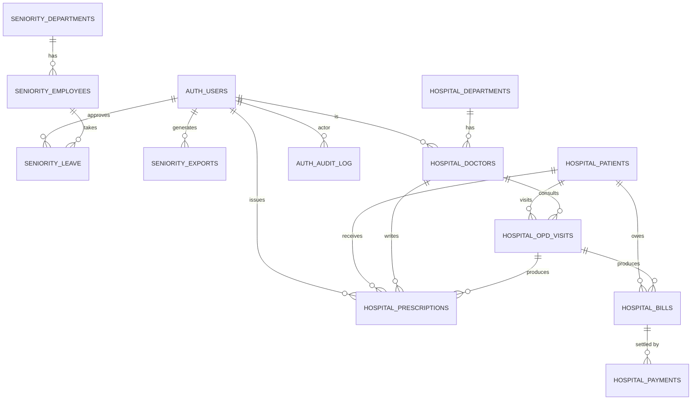

# Database Schema

> One PostgreSQL 16 database, multiple logical schemas, one pool, one backup.
> Decisions: see `docs/adr/0003-postgres-schema-separation.md` and `docs/adr/0005-migration-tool-node-pg-migrate.md`.

---

## 1. Conventions (apply to every schema)

Every **writeable** table includes:

| Column        | Type           | Default                     | Notes                                |
|---------------|----------------|-----------------------------|--------------------------------------|
| `id`          | `uuid`         | `gen_random_uuid()`         | PK; generated by Postgres.           |
| `created_at`  | `timestamptz`  | `now()`                     | set on insert.                       |
| `updated_at`  | `timestamptz`  | `now()`                     | trigger-maintained.                  |
| `created_by`  | `uuid`         | null                        | FK → `auth.users.id`, soft.          |
| `updated_by`  | `uuid`         | null                        | FK → `auth.users.id`, soft.          |
| `is_deleted`  | `boolean`      | `false`                     | soft-delete flag (per `1 hms.md`).   |
| `deleted_at`  | `timestamptz`  | null                        | set when soft-deleted.               |
| `deleted_by`  | `uuid`         | null                        | FK → `auth.users.id`, soft.          |

- **No hard `DELETE` in business code.** Hard delete is allowed only in a maintenance script.
- **No cross-schema joins.** If you need data from another schema, expose it via API or replicate.
- **Naming**: singular table names (`patient`, `doctor`, `employee`). Underscored, lowercase. Pluralize at the API layer.
- **Timestamps** always `timestamptz`. Never `timestamp`.
- **Enums** as `text` + `CHECK` (not Postgres `ENUM` type — easier migrations).
- **Money**: `numeric(12,2)` (or `bigint` cents for performance).
- **JSON**: `jsonb` with a Zod validator on the API side.

Per-schema triggers (set in the migration):

```sql
CREATE OR REPLACE FUNCTION set_updated_at() RETURNS trigger AS $$
BEGIN NEW.updated_at = now(); RETURN NEW; END;
$$ LANGUAGE plpgsql;
```

---

## 2. Schema map

```
auth
 └─ users
 └─ role_permissions
 └─ audit_log        (security-relevant events)

portfolio
 └─ services
 └─ projects
 └─ testimonials
 └─ faq
 └─ blog_posts
 └─ links
 └─ calendar_holidays

seniority
 └─ employees
 └─ departments
 └─ leave
 └─ seniority_rules
 └─ exports
 └─ audit_log

hospital
 └─ patients (uhid, master, medical_history, emergency_contact)
 └─ doctors
 └─ departments
 └─ opd_visits (vitals, consultation, diagnosis, follow_up)
 └─ prescriptions (rx)
 └─ investigations (lab + radiology)
 └─ bills / bill_items / payments
 └─ pharmacy_items / pharmacy_stock / pharmacy_purchases / pharmacy_sales
 └─ lab_tests / lab_results
 └─ radiology_orders / radiology_reports
 └─ documents
 └─ audit_log
```

---

## 3. `auth` schema

```sql
create schema if not exists auth;

create table auth.users (
  id              uuid primary key default gen_random_uuid(),
  auth_id         text not null unique,         -- Authentik subject
  email           citext not null unique,
  display_name    text not null,
  avatar_url      text,
  tenant          text check (tenant in ('portfolio','seniority','hospital') or tenant is null),
  role            text not null,                -- single role for v1
  is_active       boolean not null default true,
  last_login_at   timestamptz,
  created_at      timestamptz not null default now(),
  updated_at      timestamptz not null default now(),
  created_by      uuid,
  updated_by      uuid,
  is_deleted      boolean not null default false,
  deleted_at      timestamptz,
  deleted_by      uuid
);

create table auth.role_permissions (
  id          uuid primary key default gen_random_uuid(),
  role        text not null,
  resource    text not null,                    -- e.g. "patient", "prescription"
  action      text not null,                    -- "read" | "create" | "update" | "delete" | "print"
  constraint uq_role_perm unique (role, resource, action)
);

create table auth.audit_log (
  id          bigserial primary key,
  occurred_at timestamptz not null default now(),
  actor_id    uuid,                            -- auth.users.id
  actor_email text,
  tenant      text,
  action      text not null,                    -- "login", "logout", "create_patient", ...
  resource    text,
  resource_id text,
  ip          inet,
  user_agent  text,
  meta        jsonb
);
```

---

## 4. `portfolio` schema

The static site's content, now queryable from the API. Replaces JSON config in `data/`.

```sql
create schema if not exists portfolio;

create table portfolio.services (
  id          uuid primary key default gen_random_uuid(),
  slug        text not null unique,            -- url-friendly id
  title       text not null,
  icon        text,                            -- fa-icon name
  tagline     text,
  summary     text,
  bullets     jsonb not null default '[]',
  sort_order  int not null default 0,
  is_published boolean not null default true,
  -- audit columns
);

create table portfolio.projects (
  id          uuid primary key default gen_random_uuid(),
  slug        text not null unique,
  domain      text not null,                   -- "electrical", "photography", ...
  client      text,
  title       text not null,
  description text,
  cover_url   text,
  gallery     jsonb not null default '[]',
  completed_at date,
  -- audit columns
);

create table portfolio.testimonials (
  id          uuid primary key default gen_random_uuid(),
  author_name text not null,
  author_role text,
  author_avatar text,
  rating      smallint check (rating between 1 and 5),
  body        text not null,
  sort_order  int not null default 0,
  -- audit columns
);

create table portfolio.faq (
  id          uuid primary key default gen_random_uuid(),
  question    text not null,
  answer      text not null,
  sort_order  int not null default 0,
  -- audit columns
);

create table portfolio.blog_posts (
  id          uuid primary key default gen_random_uuid(),
  slug        text not null unique,
  title       text not null,
  excerpt     text,
  body_md     text not null,                   -- markdown
  cover_url   text,
  tags        text[] not null default '{}',
  author_id   uuid references auth.users(id),
  published_at timestamptz,
  -- audit columns
);

create table portfolio.links (
  id          uuid primary key default gen_random_uuid(),
  title       text not null,
  url         text not null,
  category    text,
  description text,
  status      text default 'live' check (status in ('live','beta','archived','broken')),
  sort_order  int not null default 0,
  -- audit columns
);

create table portfolio.calendar_holidays (
  id          uuid primary key default gen_random_uuid(),
  holiday_date date not null unique,
  name        text not null,
  region      text default 'IN',
  kind        text default 'public' check (kind in ('public','optional','observance')),
  -- audit columns
);
```

---

## 5. `seniority` schema

Replaces `Seniariity_Management.html` + `Seniariity_List.html`. Per `2.Seniarity.md` (which is the same doc as `1 hms.md` — note: both files are titled "Hospital Management System"; the Seniority module is the v1 scope).

```sql
create schema if not exists seniority;

create table seniority.departments (
  id          uuid primary key default gen_random_uuid(),
  code        text not null unique,
  name        text not null,
  parent_id   uuid references seniority.departments(id),
  -- audit columns
);

create table seniority.employees (
  id              uuid primary key default gen_random_uuid(),
  emp_code        text not null unique,        -- business-facing id
  full_name       text not null,
  gender          text check (gender in ('male','female','other')),
  dob             date,
  doj             date not null,               -- date of joining
  department_id   uuid not null references seniority.departments(id),
  designation     text not null,
  grade           text,                        -- pay grade / level
  cadre           text,                        -- "A", "B", "C" ...
  status          text not null default 'active'
                  check (status in ('active','on_leave','suspended','retired','resigned','terminated')),
  email           citext,
  phone           text,
  address         text,
  qualifications  jsonb not null default '[]',
  -- audit columns
);

create table seniority.leave (
  id            uuid primary key default gen_random_uuid(),
  employee_id   uuid not null references seniority.employees(id),
  leave_type    text not null,                 -- "casual","sick","earned","unpaid"
  from_date     date not null,
  to_date       date not null,
  days          numeric(5,2) not null,
  reason        text,
  status        text not null default 'pending'
                check (status in ('pending','approved','rejected','cancelled')),
  approved_by   uuid references auth.users(id),
  approved_at   timestamptz,
  -- audit columns
);

create table seniority.seniority_rules (
  id            uuid primary key default gen_random_uuid(),
  name          text not null,
  description   text,
  formula       text not null,                 -- e.g. "doj ASC, grade DESC, dob ASC"
  is_active     boolean not null default true,
  effective_from date not null,
  -- audit columns
);

create table seniority.exports (
  id            uuid primary key default gen_random_uuid(),
  generated_by  uuid not null references auth.users(id),
  format        text not null check (format in ('pdf','xlsx','csv')),
  filter        jsonb not null default '{}',
  file_url      text,
  generated_at  timestamptz not null default now()
);

create table seniority.audit_log ( ... );     -- same shape as auth.audit_log
```

---

## 6. `hospital` schema

Per `1 hms.md`. All 13 modules map to tables here. This is the largest schema. Sub-schemas-as-folders (organisational only — physical: still one schema):

| Folder                  | Tables                                                            |
|-------------------------|-------------------------------------------------------------------|
| `master/`               | `departments`, `doctors`                                          |
| `patients/`             | `patients`, `patient_medical_history`, `patient_documents`        |
| `opd/`                  | `opd_visits`, `vitals`, `consultations`, `diagnoses`, `follow_ups`|
| `prescriptions/`        | `prescriptions`, `prescription_items`                             |
| `investigations/`       | `lab_tests`, `lab_results`, `radiology_orders`, `radiology_reports`|
| `billing/`              | `bills`, `bill_items`, `payments`                                 |
| `pharmacy/`             | `medicines`, `medicine_batches`, `purchases`, `sales`, `stock_movements`|
| `documents/`            | `documents`                                                       |
| `audit/`                | `audit_log`                                                       |

Example table shapes (representative, not exhaustive):

```sql
create schema if not exists hospital;

create table hospital.patients (
  id                uuid primary key default gen_random_uuid(),
  uhid              text not null unique,             -- business-facing id
  full_name         text not null,
  gender            text not null check (gender in ('male','female','other')),
  dob               date not null,
  age_years         smallint,                          -- computed; cache
  blood_group       text,
  marital_status    text,
  occupation        text,
  mobile            text,
  email             citext,
  address           text,
  emergency_contact_name  text,
  emergency_contact_phone text,
  aadhaar           text,                              -- encrypted at app layer
  photo_url         text,
  registered_at     timestamptz not null default now(),
  -- audit columns
);

create table hospital.doctors (
  id                uuid primary key default gen_random_uuid(),
  doctor_code       text not null unique,
  full_name         text not null,
  qualification     text,
  registration_no   text,
  department_id     uuid references hospital.departments(id),
  specialization    text,
  mobile            text,
  email             citext,
  consultation_fee  numeric(12,2) not null default 0,
  signature_url     text,                              -- PNG of signature for rx
  -- audit columns
);

create table hospital.opd_visits (
  id                uuid primary key default gen_random_uuid(),
  opd_number        text not null unique,
  patient_id        uuid not null references hospital.patients(id),
  doctor_id         uuid references hospital.doctors(id),
  department_id     uuid references hospital.departments(id),
  visit_at          timestamptz not null default now(),
  vitals            jsonb,                             -- bp, pulse, temp, spo2, weight
  consultation_note text,
  diagnosis         text,
  follow_up_date    date,
  status            text not null default 'open'
                    check (status in ('open','closed','cancelled')),
  -- audit columns
);

create table hospital.prescriptions (
  id                uuid primary key default gen_random_uuid(),
  visit_id          uuid not null references hospital.opd_visits(id) on delete restrict,
  patient_id        uuid not null references hospital.patients(id),
  doctor_id         uuid not null references hospital.doctors(id),
  rx_number         text not null unique,
  notes             text,
  -- audit columns
);

create table hospital.prescription_items (
  id                uuid primary key default gen_random_uuid(),
  prescription_id   uuid not null references hospital.prescriptions(id) on delete cascade,
  medicine_name     text not null,
  generic_name      text,
  brand_name        text,
  strength          text,
  dosage            text not null,                    -- "1 tablet"
  frequency         text not null,                    -- "1-0-1"
  duration          text not null,                    -- "5 days"
  route             text,                             -- "oral"
  instructions      text,
  sort_order        smallint not null default 0
);

create table hospital.bills (
  id                uuid primary key default gen_random_uuid(),
  bill_number       text not null unique,
  patient_id        uuid not null references hospital.patients(id),
  visit_id          uuid references hospital.opd_visits(id),
  bill_type         text not null check (bill_type in ('consultation','investigation','pharmacy','custom')),
  subtotal          numeric(12,2) not null default 0,
  discount          numeric(12,2) not null default 0,
  tax               numeric(12,2) not null default 0,
  total             numeric(12,2) not null default 0,
  paid              numeric(12,2) not null default 0,
  status            text not null default 'unpaid'
                    check (status in ('unpaid','partial','paid','cancelled','refunded')),
  -- audit columns
);

create table hospital.payments (
  id                uuid primary key default gen_random_uuid(),
  bill_id           uuid not null references hospital.bills(id),
  mode              text not null check (mode in ('cash','upi','card','bank_transfer','cheque','other')),
  amount            numeric(12,2) not null,
  reference         text,                             -- UPI txn id, cheque no, ...
  paid_at           timestamptz not null default now()
);

-- ... similar for lab_results, radiology_reports, pharmacy_stock, etc.
```

`hospital.audit_log` mirrors `auth.audit_log`.

---

## 7. Schema-aware pool pattern (API)

```ts
// api/src/database/pool.ts
import { Pool } from 'pg';

let pool: Pool;

export function getPool(): Pool {
  if (!pool) {
    pool = new Pool({ connectionString: process.env.DATABASE_URL });
  }
  return pool;
}

export async function query<T = any>(
  schema: string,
  text: string,
  params: any[] = []
): Promise<{ rows: T[]; rowCount: number }> {
  const client = await getPool().connect();
  try {
    await client.query(`SET LOCAL search_path TO ${schema}, public`);
    const res = await client.query(text, params);
    return { rows: res.rows as T[], rowCount: res.rowCount ?? 0 };
  } finally {
    client.release();
  }
}
```

Each repository lives next to its module and only ever calls `query('seniority', ...)` or similar — no schema name leaks into business code.

---

## 8. Migration folder layout

```
db/
├── migrations/
│   ├── auth/
│   │   ├── 1717000000000_init.js
│   │   └── 1717000001000_role_permissions.js
│   ├── portfolio/
│   │   └── 1717000002000_init.js
│   ├── seniority/
│   │   ├── 1717000003000_init.js
│   │   └── 1717000003001_seed_departments.js
│   └── hospital/
│       ├── 1717000004000_init.js
│       └── 1717000004001_seed_departments.js
├── seeds/
│   ├── auth_role_permissions.sql
│   ├── portfolio_seed.sql
│   ├── seniority_departments.sql
│   └── hospital_departments.sql
└── package.json   # node-pg-migrate scripts
```

---

## 9. ER overview (Mermaid source in `docs/diagrams/er-overview.mmd`)



---

## 10. Open questions

- Do we need per-tenant encryption keys (BYOK) for `hospital.patients.aadhaar`? Default: no (rely on TLS + at-rest disk encryption).
- Lab/radiology integrations (HL7/FHIR)? Defer until a customer asks.
- Pharmacy regulatory needs (schedules H/H1/X)? Defer; model `medicines.schedule text` as a free-form field for now.
